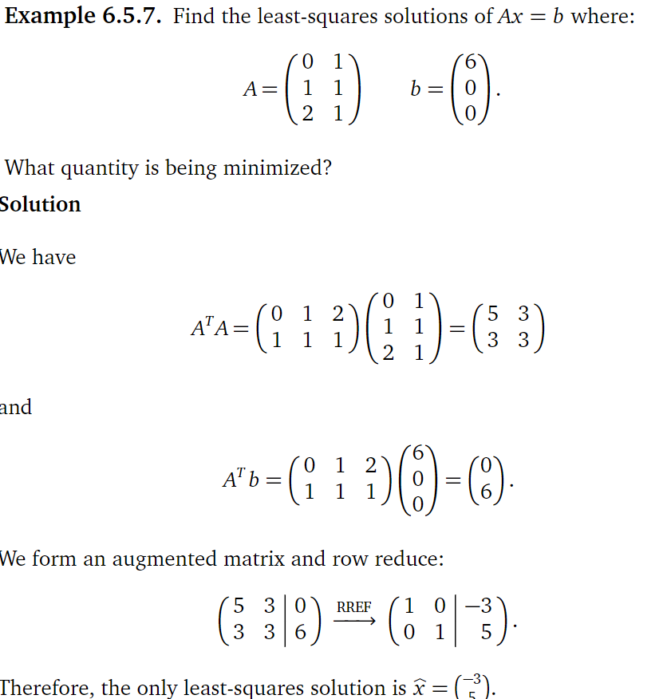

Given: (0,6),(1,0),(2,0),

y=Mx+B.

6=M·0+B

0=M·1+B

0=M·2+B.

Putting our linear equations into matrix form, we are trying to solve Ax=b 

A = [[0,1],[1,1],[2,1]]   
x = [M, B]  
b = [[6],[0],[0]]
x=(ATA)−1ATb.
ATA = 

